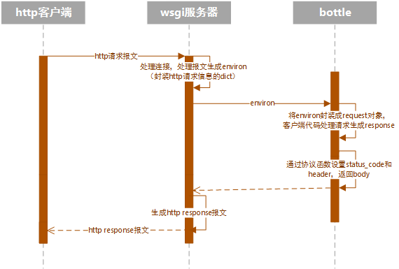

### bottle的request和wsgi协议

这篇博文讨论，从客户端发起一个http请求，到bottle生成一个request对象的过程。

先画一个请求http过程的简单序列图：
    


bottle是一个支持wsgi的框架。当客户端发起一个http请求时，http报文会先经过wsgi服务器处理成一个environ
字典，bottle拿到这个字典之后封装成一个全局的request对象，用户代码拿到这个request封装的信息，进行业务逻辑处理返回response对象，经wsgi服务器处理成http res报文返回给http客户端.

bottle的request是用来处理封装environ字典的，这个字典是由wsgi服务器生成的。environ里都有些什么呢。一个简单的办法是跑一下 python -m wsgiref.simple_server，这时会打开默认浏览器，发起一个本地8000端口的http get请求，在页面上会看到这一个get请求经过wsgi服务器处理之后生成的environ字典的内容，具体每一个字段什么意思可以翻阅一个pep3333的这个章节https://www.python.org/dev/peps/pep-3333/#environ-variables。bottle的默认开发服务器也是wsgiref.simple_server。这里聊一下GET，POST请求的处理过程。
#### 1、GET
    在刚才打开的页面里，你可以看到这个get请求的两个关键key-value，一个是REQUEST_METHOD = 'GET', 另外一个是QUERY_STRING = 'abc'（这里不讨论header里的内容）。到源码里看一下bottle是如何处理这两个keyvalue的。bottle是使用Bottle类的对象作为wsgi协议函数的，所以Bottle的对象是callable的，Bottle会实现__call__方法。调用过程是Bottle.__call__ --> Bottle.wsgi --> Bottle._handle--> request.bind，使用environ字典初始化生成一个全局的request对象。定位到BaseRequest.GET方法就可以看到，GET是query的一个别名。
    query方法在self.environ增加一个key 'bottle.get'，然后对QUERY_STRING进行了解析，经过装饰器返回一个类字典的只读对象供用户使用。用户代码就可以通过request.GET拿到GET请求的请求参数了。
####2、POST
    POST请求的数据都是放在body里进行行提交的，假如用户提交的是表单，这里关注environ中的四个key-value：
```python
        REQUEST_METHOD = 'POST'
        CONTENT_LENGTH = ''
        CONTENT_TYPE = 'multipart/form-data; boundary=----WebKitFormBoundary5N9kIKpwXYrgi5jb'
        wsgi.input = <_io.BufferedReader name=636>
 ```
    前三个不在多说。wsgi.input是wsgi服务器生成的一个文件对象通过environ传给了bottle，bottle就是通过这个file对象读取body中内容然后进行解析，查看BaseRequest.POST方法,在self._body 里对environ['wsgi.input']进行处理返回一个BytesIO()对象，然后借助cgi.FieldStorage类型解析body数据，返回表单键值对及文件对象。
可以跑一下这个代码https://github.com/kagxin/recipes/blob/master/bottle/wsgi_server.py 这个代码使用，postman等客户端工具发起GET和POST请求查看environ变量的内容。定位到demo_app里到wsgiref.simple_server里看一下demo_app 和 主函数就知道 python -m wsigref.simple_server为什么是刚才的现象。simple_server是使用原来的HttpServer BaseHTTPRequestHandler,进行http协议的报文解析，在原有的解析内容中增加一些wsgi需要的key-value得到了wsgi标准的environ。

